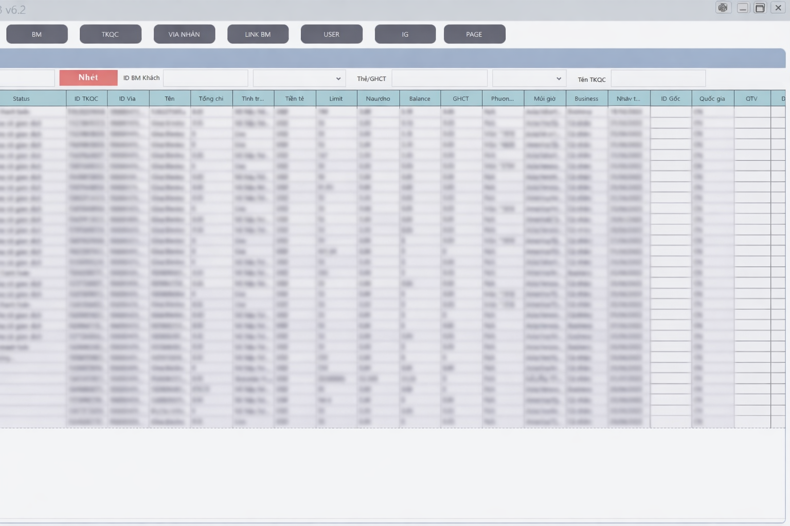

# Digital Marketing Asset Manager (DMAM)

DMAM là một ứng dụng **Desktop Windows** được xây dựng để phục vụ **quản lý tài nguyên và quy trình marketing kỹ thuật số trong môi trường nội bộ doanh nghiệp**.

Ứng dụng hướng tới việc hỗ trợ team vận hành quảng cáo xử lý khối lượng lớn tài khoản, dữ liệu và tác vụ lặp lại một cách ổn định và có kiểm soát.

> ⚠️ **Lưu ý**  
> Đây là ứng dụng nội bộ từng được sử dụng trong doanh nghiệp.  
> Mã nguồn và logic xử lý không được công khai do liên quan đến bảo mật và quy trình vận hành.

---

## 🎯 Mục tiêu dự án

Dự án được xây dựng với các mục tiêu chính:

- Tập trung hóa việc quản lý tài nguyên marketing
- Giảm thao tác thủ công trong quá trình vận hành hằng ngày
- Chuẩn hóa luồng xử lý và trạng thái tài khoản
- Hỗ trợ team kỹ thuật và vận hành phối hợp hiệu quả hơn

Ứng dụng **không hướng tới người dùng đại trà**, chỉ phục vụ nhu cầu nội bộ.

---

## ✨ Chức năng chính

- Quản lý dữ liệu tập trung qua giao diện bảng
- Tự động hóa các thao tác lặp lại
- Xử lý đa luồng với giới hạn song song
- Giao tiếp API và xử lý dữ liệu trả về
- Kiểm soát session và trạng thái tài khoản
- Cơ chế retry và xử lý lỗi mạng
- Theo dõi tiến trình và kết quả theo thời gian thực

---

## 🧱 Kiến trúc tổng thể

- Ứng dụng WinForms theo mô hình event-driven
- Phân tách rõ:
  - Giao diện người dùng
  - Logic xử lý nghiệp vụ
  - Lớp giao tiếp mạng và automation
- Quản lý task, session và trạng thái riêng biệt
- Thiết kế phục vụ mở rộng và bảo trì trong môi trường nội bộ

---

## 🛠 Công nghệ sử dụng

- **Ngôn ngữ:** C#
- **Framework:** .NET Framework
- **Giao diện:** WinForms (Guna UI)
- **Networking:** HttpClient, xNet
- **Xử lý dữ liệu:** Newtonsoft.Json, HtmlAgilityPack
- **Automation:** Selenium WebDriver (Chrome)
- **Bất đồng bộ:** async/await, multi-threading

---

## 📈 Kết quả đạt được

- Chuẩn hóa luồng thao tác cho team vận hành
- Giảm đáng kể các thao tác thủ công lặp lại
- Tăng khả năng kiểm soát trạng thái và tiến trình xử lý
- Ứng dụng hoạt động ổn định với khối lượng tác vụ lớn

---

## 🔒 Bảo mật

- Mã nguồn được giữ ở trạng thái private
- Không công khai logic xử lý, endpoint, dữ liệu thật
- Nội dung public chỉ mang tính **giới thiệu kinh nghiệm và portfolio cá nhân**

---

## 🚀 Trạng thái dự án

- Đã triển khai và sử dụng thực tế trong doanh nghiệp
- Hiện không còn phát triển thêm
- Được lưu trữ như một dự án kinh nghiệm thực tế

---

## 👥 Tác giả

- **Nhật Tiến**  
  Vai trò: Phân tích yêu cầu, thiết kế kiến trúc, phát triển các chức năng chính

- **Chí Cường**  
  Vai trò: Phát triển logic nghiệp vụ, tối ưu hiệu năng, hỗ trợ triển khai

---

## 📷 Demo giao diện (đã ẩn dữ liệu)

Giao diện đã được làm mờ và thay thế dữ liệu nhằm bảo vệ thông tin nội bộ của doanh nghiệp.

---

## 📌 Liên hệ

Repo này được dùng để giới thiệu tổng quan dự án.  
Chi tiết triển khai có thể trao đổi trực tiếp trong buổi phỏng vấn kỹ thuật.

- GitHub cá nhân: https://github.com/Nhattien2912
